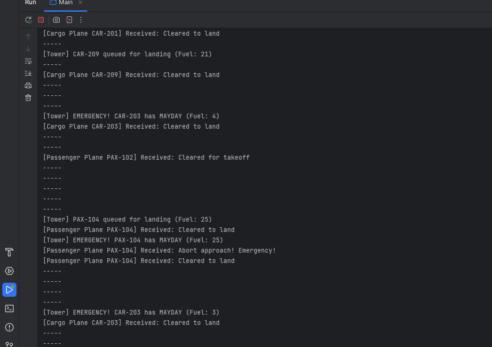

Why is Mediator Better than Aircraft Talking Directly
In a system where multiple aircraft need to coordinate landings, takeoffs, and emergencies on a shared runway, allowing them to communicate directly would quickly become unmanageable. Each aircraft would need to know about every other aircraft and handle complex interaction rules like priority, fuel levels, or emergency cases. This would lead to tight coupling, duplicated logic, and unpredictable behavior—especially during conflicts like simultaneous landing requests or MAYDAY events.
The Mediator pattern solves this by centralizing all coordination in a single object: the ControlTower. Now, aircraft don’t talk to each other; they talk through the tower. This decouples components and makes the system easier to understand, maintain, and extend. The ControlTower becomes the source of truth for runway availability, and can enforce complex logic like clearing the runway during emergencies or prioritizing low-fuel aircraft.
A clear benefit is flexibility: we can add new aircraft types (e.g., drones, VIP jets) without changing existing classes. This aligns with the Open/Closed Principle. Additionally, the Mediator improves testability—it's easier to test interactions in isolation.
Disadvantage:
One downside is that the Mediator can become a "God object"—bloated with too much logic. As more features are added (like weather, delays, or VIP priority), the tower may become complex and harder to maintain unless logic is further modularized (e.g., using Strategy for scheduling). It's important to balance centralization with modularity.

Example Airport Tower Simulator:

Example Streaming‑Service Binge Mode:

